# KitaAgro

KitaAgro is a Flutter mobile app that helps farmers and home growers make faster, more informed decisions through:

- AI diagnostics (pest/disease + nutrient deficiency) from camera/gallery images
- A context-aware AI plantation assistant chat (video call feature supported)
- progress tracking (plants, milestones, and growth progress insights)
- journal creation with a photo timeline (track plant health over time + AI photo check)
- Plant Dictionary with location-aware growing guidance and one-tap add-to-garden
- A pest distribution map + push alerts based on nearby reports and wind direction
- A farmer hub for land rental listings + marketplace/map discovery
- Community feed + direct messaging

---

## Problem Statement

Malaysia’s agricultural sector is facing a compounding crisis with two root causes:

- **Demographic challenge (youth exodus)**
	- The average farmer is over 60 years old.
	- Many young Malaysians (18–45) avoid agriculture due to high financial barriers and limited land access.
	- Bureaucratic complexity makes onboarding harder (e.g., navigating the **e-GAN** portal for the **RM30,000 Agropreneur NextGen grant**).

- **Agronomic challenge (reactive farming)**
	- Farmers face serious pest infestations and crop diseases.
	- Without modern decision-support tools, actions are often reactive instead of predictive/data-driven.

**What KitaAgro changes**

- Lowers the entry barrier with **step-by-step grant application guidance** and a **searchable farmland rental marketplace**.
- Strengthens on-farm decisions with **AI-powered crop diagnosis**, a **personalized farming assistant**, and a **real-time, wind-based pest early warning system**.

**Why it matters**

- Helps make farming a viable, supported career choice for youth.
- Protects crop yields and strengthens national food security.

---

## SDGs Tackled (Target)

| SDG | Targets | What KitaAgro enables | Features in app |
| --- | --- | --- | --- |
| **2: Zero Hunger** | **2.3**, **2.4** | Improves smallholder productivity and resilience through earlier detection and faster intervention. | AI diagnostics (pest/nutrient), wind-based pest early warning map + alerts, AI assistant |
| **4: Quality Education** | **4.4** | Builds practical agricultural skills through accessible, context-aware learning and guidance. | Plant Dictionary, AI assistant chat/video guidance, community knowledge sharing |
| **8: Decent Work & Economic Growth** | **8.2** | Increases agropreneur productivity by lowering onboarding friction and adding technology-assisted decision support. | e-GAN grant tutorial, land rental marketplace, AI diagnostics + assistant |
| **12: Responsible Consumption & Production** | **12.3** | Reduces avoidable crop and post-harvest losses through earlier risk detection and more targeted farm actions. | Pest outbreak reporting + alerts, My Garden/My Journey tracking, marketplace/discovery features |

These targets are selected to address Malaysia's demographic and agronomic pressures: low youth participation in agriculture and high crop-loss risk from pests and diseases. KitaAgro links onboarding and economic enablement (grant guidance + land access) with practical AI-driven support (diagnosis, wind-based alerts, and assistant guidance), so farming shifts from reactive decision-making to proactive, technology-assisted practice.

---

## Solution Overview

KitaAgro provides five integrated capabilities:

1. **AI Diagnostics (Scan)**
	 - Users capture/select a plant image and choose **Pest** or **Nutrient** mode.
	 - The app calls Gemini (REST) and returns a **Markdown** analysis with symptoms and solutions.

2. **Pest Outbreak Awareness + Alerts**
	 - A shared map shows active pest reports (Firestore: `pest_reports`).
	 - A global alert engine listens for new reports and sends a **local push notification** if the user is in a calculated risk zone.

3. **Farmer Hub (Land + Marketplace/Map)**
	 - Browse land listings from Firestore (`lands`) with offline caching.
	 - Discover farmers/companies/products and map-based browsing.

4. **Community + Messaging**
	 - Community posts (Firestore: `posts`) to share progress and issues.
	 - Direct chat with friends or professionals (Firestore: `chats/*/messages`) including unread badges.

5. **Progress Tracking (My Garden + My Journey + Dictionary)**
	 - **Dictionary:** browse crops and get localized growing guidance (weather/location-aware) and add plants into your garden.
	 - **My Garden:** track your planted crops and view progress-oriented insights.
	 - **My Journey:** create a visual journal with periodic photos; the app stores your timeline and supports AI-based photo diagnosis.

---

## Technical Architecture*

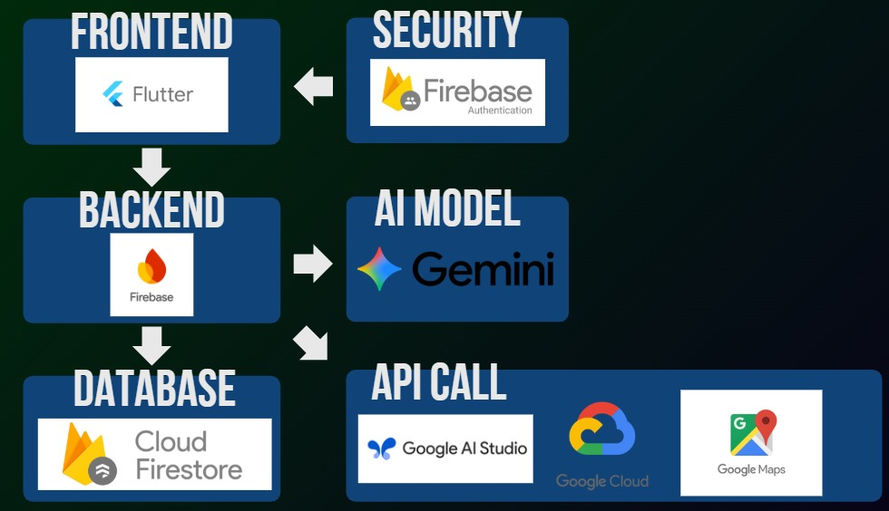

Core stack:

- **Flutter (Material 3)**
- **Firebase Auth** for sign-in/session
- **Cloud Firestore** for app data (posts, chats, users, lands, pest reports)
- **Firebase Storage** for chat attachments
- **Google Maps Flutter + Geolocator** for location experiences
- **Gemini (Google Generative Language API)** via REST calls
- **Local notifications** (`flutter_local_notifications`)
- **Local storage** (`shared_preferences`) for on-device notification inbox state

Key Firestore collections (from code usage):

- `users` (profile + nested `plantations`, `notifications`)
- `posts`
- `chats` (with subcollection `messages`)
- `lands`
- `products`, `farmers`, `companies`
- `pest_reports`

Mermaid diagram (logical view):

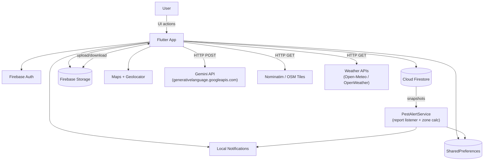

Implementation anchors in the codebase:

- App entry + global alert engine: `lib/main.dart`
- Main navigation: `lib/main_layout.dart`
- Pest alert engine: `lib/core/services/pest_alert_service.dart`
- AI image analysis + AI assistant: `lib/core/services/gemini_api_service.dart`
- Chat data layer: `lib/services/chat_service.dart`
- Local notification inbox storage: `lib/core/services/notification_storage.dart`

---

## System Flow/Implementation details*

### 1) Authentication + Profile completion

- `AuthWrapper` listens to `FirebaseAuth.instance.authStateChanges()`.
- If user is authenticated but profile is incomplete, user is routed to profile completion.

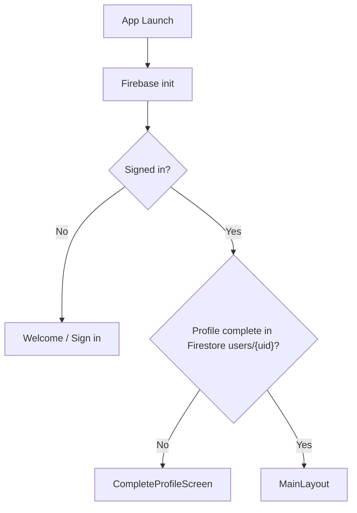

### 2) AI Diagnostics (image → diagnosis)

- User selects camera/gallery.
- App encodes image to Base64.
- Sends prompt + image to Gemini (`gemini-2.5-flash:generateContent`).
- Displays formatted Markdown results.

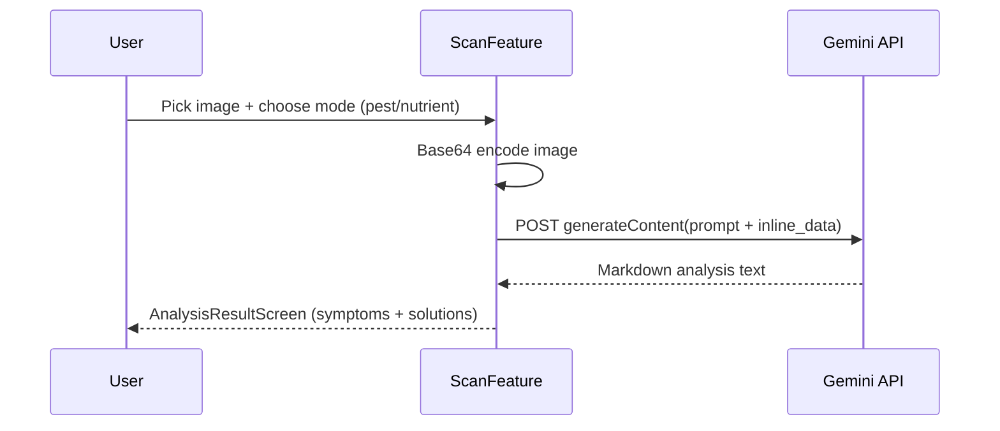

### 3) Pest reporting → risk zone → push alerts

- Pest reports are stored in Firestore collection `pest_reports`.
- `PestAlertService` listens to `pest_reports` snapshot changes globally.
- For each new report, it calculates user distance and a wind-stretched ellipse zone:
	- `DANGER ZONE` (small), `WARNING ZONE` (mid), `MONITORING ZONE` (large), else `CLEAR`
- If zone is not `CLEAR`, it triggers a local push notification and stores a copy in local inbox.

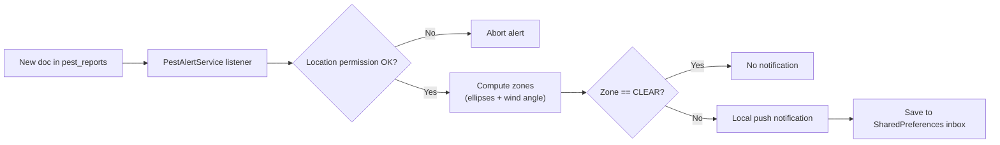

### 4) Messaging (chats + unread badges)

- Chats live in `chats` with `participants` array and unread counters per user.
- Messages are stored in `chats/{chatId}/messages`.
- Attachments upload to Firebase Storage and URLs are stored with message.

### 5) Dictionary → localized guidance → add to My Garden

- Users browse plant cards in the Dictionary.
- The app can generate **localized growing guidance** (weather/location-aware) using:
	- device location (Geolocator)
	- weather lookups (Open-Meteo / OpenWeather)
	- Gemini prompts to produce actionable advice
- When the user taps **Add to Garden**, a plantation record is created under:
	- `users/{uid}/plantations` (with fields like `plantedAt`, `totalDays`, `icon`, `color`, and `carbonReduction`)

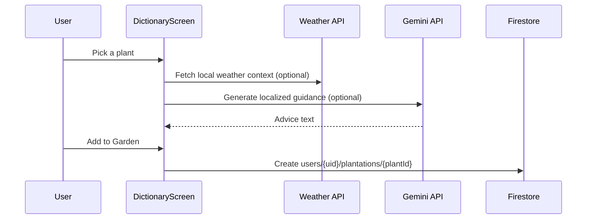

### 6) My Garden progress tracking + daily tasks

- The Home experience streams the user’s plantations:
	- `users/{uid}/plantations` via Firestore snapshots.
- Progress is computed from either `daysPlanted` (if present) or `plantedAt` timestamp.
- Health/status is summarized from the latest photo analysis fields (e.g., `latestPhotoStatus`).
- Daily tasks (if present in `dailyTasks`) are aggregated across plantations to show a “pending tasks” reminder.

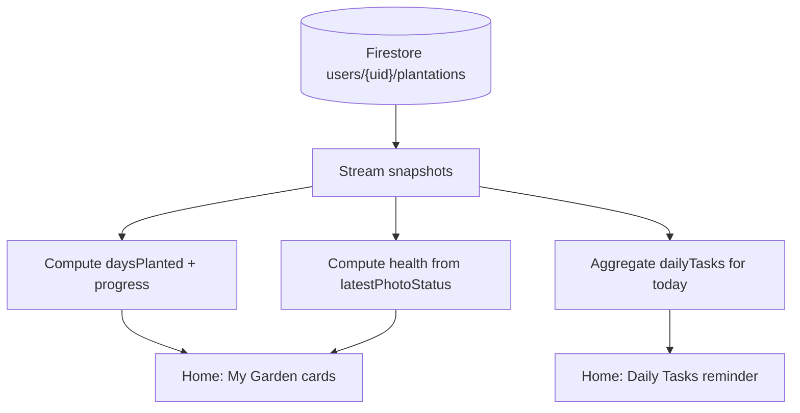

### 7) My Journey photo journal + AI photo check

- Users attach periodic photos to a plant as a visual timeline.
- On capture, the app:
	- (optionally) runs a Gemini-based “photo check”
	- immediately shows the photo in UI via a local cache
	- uploads the image to Firebase Storage
	- stores metadata in Firestore under `users/{uid}/plantations/{plantId}/photos`
	- merges `latestPhotoStatus` / `latestPhotoDiagnosis` back into the plantation doc for quick summaries

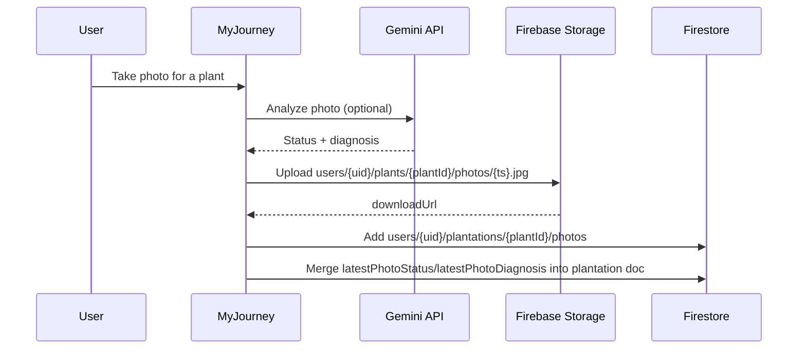

### 8) Farmer Hub (Land listings) + offline friendliness

- Land listings are read from Firestore `lands`.
- The Land Listing screen enables Firestore local persistence so previously loaded listings remain visible when offline.
- Snapshots use `includeMetadataChanges` to surface cached data while the device is offline.

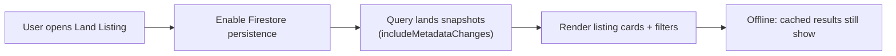

### 9) Notifications inbox + badges (pest alerts + chat)

- Pest alerts are delivered via **local notifications** and also written into a local inbox stored in `shared_preferences`.
- The Home bell icon uses the local inbox state to show unread indicators.
- Messaging unread badges are computed from chat metadata and surfaced in bottom navigation.

### 10) Community feed (posts + images + likes)

- Community posts live in Firestore `posts` and are streamed in reverse-chronological order.
- When a user attaches an image to a post, the image is uploaded to Firebase Storage (e.g., `post_images/{uuid}.jpg`) and the download URL is stored in the post document.
- Likes are updated atomically using `FieldValue.increment` and `FieldValue.arrayUnion/arrayRemove`.
- On a like, the app can also create a Firestore notification for the post publisher (via `NotificationService`).

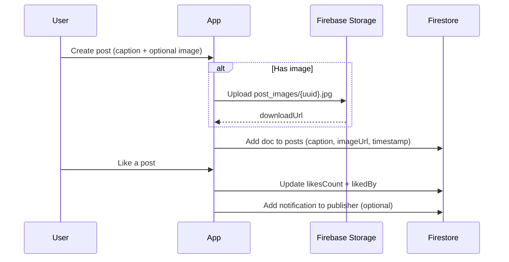

### 11) AI assistant (context-aware chat + video call)

- The assistant experience sends user prompts to Gemini and renders structured, actionable responses.
- For “video call” mode, the app requests camera + microphone permissions and provides an interactive assistant UI (device-side capture + AI guidance flow).

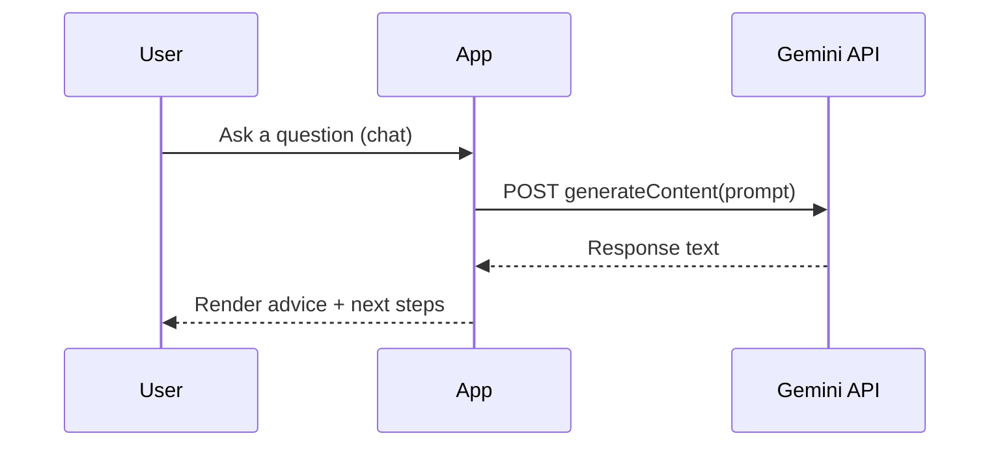

### 12) Grant tutorial (e-GAN onboarding)

- The grant guidance is implemented as an in-app, step-by-step tutorial.
- It is primarily **client-side** (Flutter UI + instructional images) and can deep-link users to the official e-GAN portal using `url_launcher`.

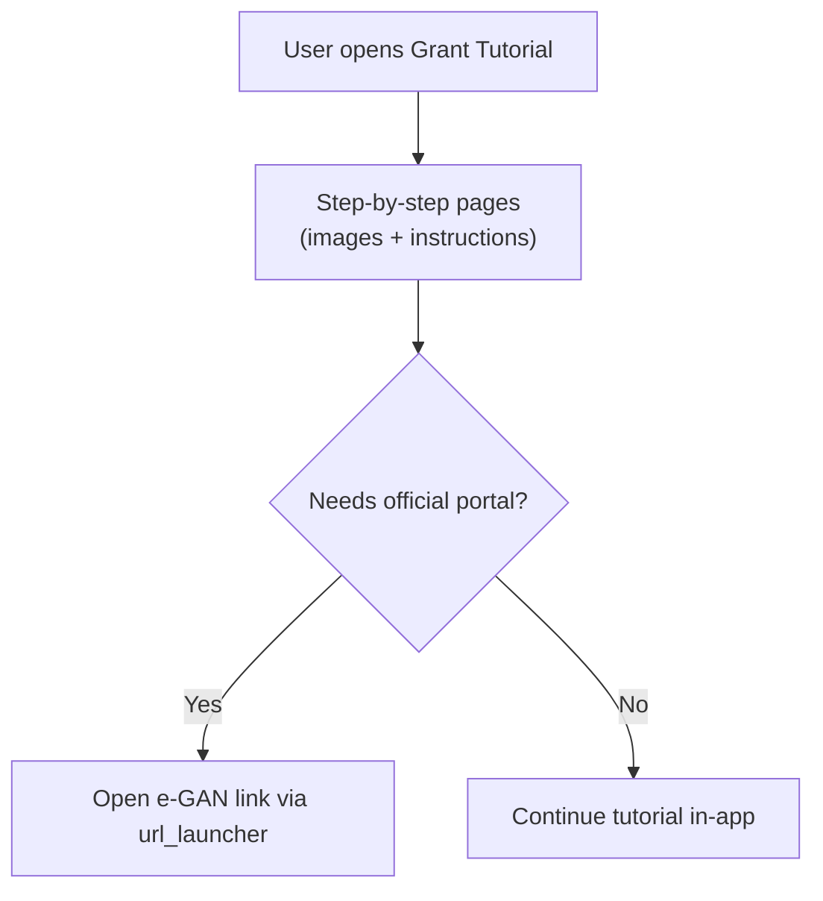

---

## User Testing & Iteration

What we iterated based on usability feedback and on-device testing:

- **AI latency/error handling:** diagnosis now shows a loading state and routes errors to a Snackbar instead of a broken screen.
- **AI quota resilience:** the Gemini service includes a quota cooldown and returns a safe fallback response when rate-limited.
- **Notification UX:** pest alerts are saved locally and an unread indicator is shown on the Home bell icon.
- **Messaging clarity:** unread chat badge count is surfaced in the bottom navigation.
- **Offline friendliness:** land listings enable Firestore persistence so previously loaded listings still show when offline.

---

## Challenges Faced*

- **Rural connectivity constraints:** many target users operate with unstable or expensive mobile data. We had to design for “good-enough offline” (cached screens, delayed uploads, and resilience to partial failures) while still keeping critical flows usable.
- **AI reliability under real-world limits:** LLM calls introduce latency, rate limits, and occasional low-confidence outputs. We implemented quota cooldowns and safe fallbacks, but long-term we must add stronger guardrails (confidence checks, clearer disclaimers, and human-verifiable guidance).
- **Geo-risk modeling is hard to validate:** translating wind direction/speed into a farmer-friendly risk visualization can produce false positives/negatives without enough ground truth. We had to balance clarity, scientific correctness, and user trust.
- **Real-time data consistency at scale:** features like community posts/likes and chat “unread” states are easy to make inconsistent across multiple devices. Keeping metadata correct (last message, unread counts, notifications) required disciplined data modeling and update rules.
- **Marketplace ecosystem bootstrapping:** a B2B/B2C marketplace has a chicken-and-egg problem (farmers, buyers, partners). Building an ecosystem requires partnerships, verification, and trust mechanisms—not just an app feature.
- **Institutional alignment and inclusivity:** grant guidelines and agency requirements evolve over time, and multi-language access (BM/Mandarin/Tamil) is essential for broad adoption. Designing content that stays accurate and accessible is an ongoing challenge.
---

## Future Roadmap*

### I) Growth Potential: From Diagnostic Tool to Digital Infrastructure

KitaAgro is designed to evolve through three strategic horizons, transitioning from a reactive utility to a predictive, end-to-end agricultural ecosystem over the next 36 months.

**Year 1: Deep Local Integration**

We aim to become the primary digital companion for the Agropreneur NextGen program. By securing a critical mass of users in Malaysia’s “Rice Bowl” states (Kedah, Perak, Johor), we will activate our Wind-Based Early Warning Network. To ensure daily retention, we are integrating real-time crop pricing from FAMA, providing farmers with immediate market leverage. In parallel, we will cooperate with agribusiness and supply-chain partners (input suppliers, aggregators, logistics, grocery buyers) to enhance our marketplace and accelerate ecosystem formation.

**Year 2: Data-Driven B2B Expansion**

As our “My Journey” dataset matures, we will transition our AI from simple diagnostics to Predictive Harvesting Engines. This data will fuel a B2B marketplace, bypassing traditional middlemen to connect farmers directly with grocery chains. We will also formalize the “land rental” feature into a Digital Tenancy Platform, solving the legal ambiguity of informal farming arrangements. To serve rural communities with unstable connectivity, we will introduce an offline-capable AI mode (on-device fallback + cached guidance) so farmers can still get actionable support without reliable internet.

**Year 3: Regional Hegemony & IoT**

Because plant diseases do not respect borders, we will scale into Indonesia and Thailand. The core architecture will expand to support on-farm IoT integration (soil and humidity sensors), shifting the platform into a hyper-local, proactive advisory service. Our ultimate goal is to provide Anonymized Outbreak Intelligence Dashboards to state agencies, embedding KitaAgro into national institutional infrastructure.

### II) Technical & Institutional Expansion

To move from our current MVP to a market-ready platform, we are prioritizing the following milestones:

**Technical Hardening**

Our immediate priority is migrating sensitive logic to Firebase Cloud Functions. This secures our API keys and enables Firebase Cloud Messaging (FCM), ensuring farmers receive critical background alerts even when the app is inactive. We are also implementing `firebase_analytics` exported to BigQuery to perform high-level trend analysis on pest migration patterns.

**Bridging the Bureaucratic Gap**

To reach a larger audience, we are implementing Full Multi-Language Support (Bahasa Malaysia, Mandarin, Tamil) using Flutter’s localization framework. Crucially, we are integrating the updated Agropreneur NextGen guidelines directly into our portal, helping young farmers navigate the application process for scale-up grants of up to RM50,000.

**From Tracking to Action**

We are evolving the “My Garden” feature from a simple photo log into an AI-Driven Task Manager. By analyzing plantation stages, the app will generate user-configurable schedules for watering, fertilizing, and monitoring, turning raw data into actionable daily workflows for the modern farmer.

---

## Project Setup

### Run the app

```bash
flutter pub get
flutter run
```

### Google APIs (Maps / Places / Geocoding)

1. In Google Cloud Console, enable:
	 - Maps SDK for Android
	 - Places API
	 - Geocoding API
2. Set the Android Maps key in `android/app/src/main/res/values/strings.xml` (`google_maps_key`).
3. Run Flutter with a REST key for Places/Geocoding calls (if used by your build):

```bash
flutter run --dart-define=GOOGLE_MAPS_API_KEY=YOUR_GOOGLE_API_KEY
```

### Setup Instructions for Judges

Since this repository is public, sensitive configuration files and API keys have been removed for security to protect our backend infrastructure and database. 

**To test the application with our live, pre-populated database:**
Instead of compiling from source, please download and install the provided compiled Android APK. This APK is securely configured to connect to our live Firebase database so you can experience all features, including mock community posts, pre-populated lands, and AI chat features.

[👉 **Download the KitaAgro APK Here**](https://drive.google.com/file/d/1wPgRDe3Nlu54Amrvg6KtMaTk8li1ptJ8/view?usp=sharing)

*(Note: If you wish to compile from source, you will need to set up your own Firebase project, run `flutterfire configure`, and provide your own Gemini API keys in a `.env` file).*

